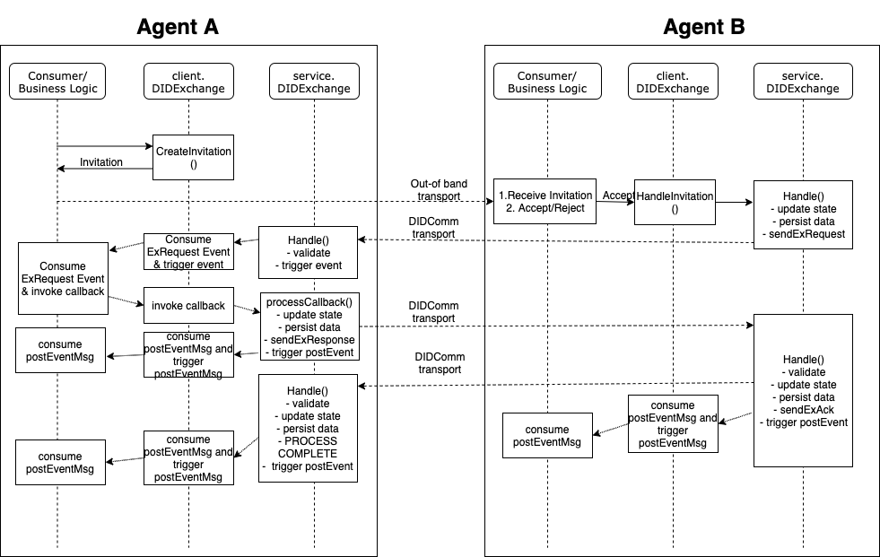

1. [Hyperledger Aries](index.html)
2. [Hyperledger Aries](Hyperledger-Aries_18481154.html)
3. [Aries Frameworks and User Groups](Aries-Frameworks-and-User-Groups_18481290.html)
4. [aries-framework-go](aries-framework-go_18481606.html)
5. [Framework Go Design](Framework-Go-Design_18512160.html)

# Hyperledger Aries : DID Exchange Flow - Framework Go

Created by Rolson Quadras, last modified on Oct 25, 2019

This page documents the DID Exchange technical flow between two Aries agents (Agent A and Agent B).

**Assumptions**:

- Pack/unpack of DIDComm envelops are not shown here
- Generation/Validation of DID Documents

## Attachments:

 [didexchange\_flow.jpg](attachments/18482344/18512165.jpg) (image/jpeg)  
 [didexchange\_flow (1).png](attachments/18482344/18512217.png) (image/png)  
 [didexchange\_flow.png](attachments/18482344/18512491.png) (image/png)

Document generated by Confluence on Nov 26, 2024 11:27

[Atlassian](http://www.atlassian.com/)
