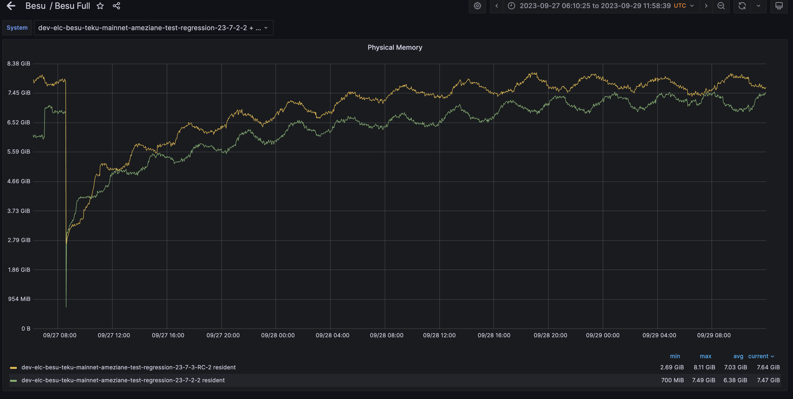
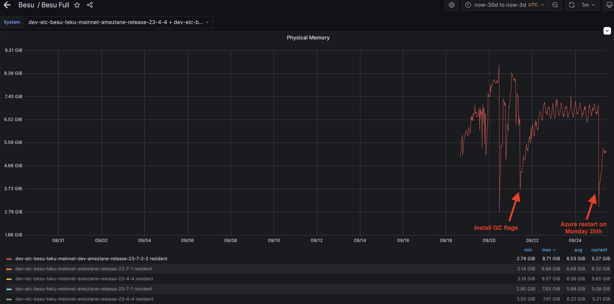
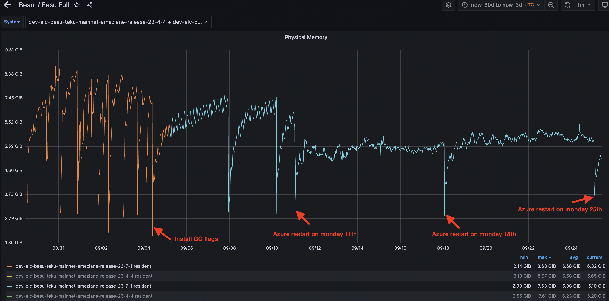
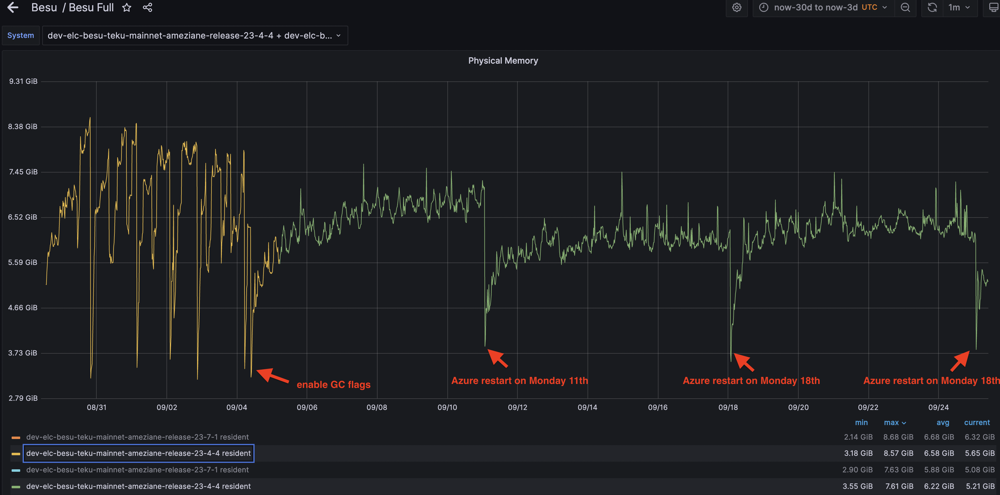
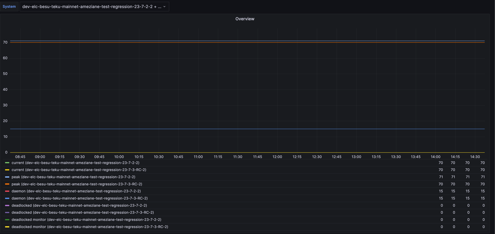
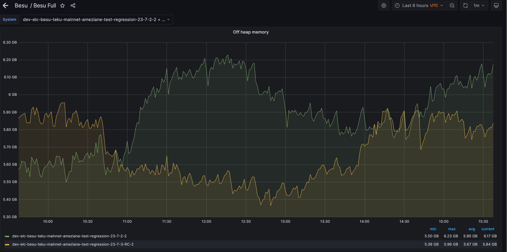

1. [Besu](index.html)
2. [Besu](Besu_22151173.html)
3. [Performance &amp; Stability](22155524.html)

# Besu : Memory usage investigations on 23.7.3-RC

Created by Ameziane Hamlat, last modified on Oct 02, 2023

# Introduction

In Java, the memory used by a process is a composite of several components, each serving a unique purpose in the functioning of the application. This memory can be defined as follows:

***Java process memory usage = Committed heap + committed non-heap + NUMBER\_OF\_THREADS * ${-Xss} + Native allocations***

1. Committed Heap: This is the actual memory reserved by the JVM for the application. It includes all objects created by the application, including those currently in use and those that are ready to be garbage collected.
2. Committed Non-Heap: This is the memory used by Java to store metadata about the application, the JIT compiled code (code cache), loaded classes, and other non-heap data.
3. Thread Stacks: Each thread in a Java application has its own stack, which is used for storing the state of method calls and local variables. The size of each thread stack is determined by the -Xss JVM option. The total memory used by all thread stacks in the application is the product of the number of threads and the -Xss value. The default value in last 64 bits JVM versions is 1 MiB.
4. Native Allocations: This refers to memory allocated by the application through native code, outside of the JVM's control.

In Besu, most of the native allocations are related to RocksDB.

# The problem

During our burn-in tests for the 23-7-3-RC release, it was observed that this version consumes more memory compared to prior releases.

This particular release comes with some GC flags enabled by default, which are designed to minimize Besu memory usage (-XX:G1ConcRefinementThreads=2 -XX:G1HeapWastePercent=15 -XX:MaxGCPauseMillis=100).

However, these flags are not present by default in the 23.7.2 release. The comparative memory usage between 23.7.2 and 23.7.3-RC can be seen in the screenshots provided below. To compare apples to apples, we enabled the same GC flags on 23.7.2.

Our tests are conducted on Azure VM with 16 GiB RAM, and all nodes are rebooted every Monday. This is the reason for the observed drops in memory usage on the 4th, 11th, 18th, and 25th of September.

We didn't specify -Xmx on these nodes, it is defaulted to 4 GiB.

# The investigation

Let's examine the memory usage patterns of the last three releases: 23.7.2, 23.7.1, and 23.4.4. This will help us establish a baseline for Besu's memory consumption.

Next, we will conduct a comparison of memory usage between the 23.7.2 and 23.7.3-RC releases, by evaluating each space type as per the formula outlined in the introduction.

## 1 . Memory usage baseline

### Memory usage on 23.7.2

It's important to note that the GC flags were activated on the 23.7.7-2 version on September 21st, and an automatic restart also occurred on Monday, September 25th. We observed that without the GC flags, Besu utilized up to 8.7 GiB of memory. However, once the flags were enabled, memory usage was capped at 7.5 GiB.

### Memory usage on 23.7.1

As depicted in the screenshot below, which represents Besu's memory usage on the 23.7.1 release, the GC flags were activated on September 4th. Additionally, automatic restarts occurred on the 11th, 18th, and 25th of September. Similar to the 23.7.2 release, Besu's memory consumption peaked at 8.7 GiB prior to the activation of the GC flags. After the GC flags were enabled, Besu's memory usage stabilized and did not exceed 7.5 GiB.

The additional restarts visible in the screenshot are likely associated with manual restarts conducted for specific testing purposes.

### Memory usage on 23.4.4

Like for the 23.7.1 release, the GC flags were activated on September 4th, with automatic restarts taking place on the 11th, 18th, and 25th of September. The memory usage pattern for the 23.4.4 release is quite similar to that of the 23.7.1 release, with a peak of approximately 8.6 GiB prior to the flag settings, and a much more stable usage below 7.5 GiB thereafter.

**According to the formula in the introduction, could the heightened memory usage in the 23.7.3-RC release be attributed to the heap, non-heap, threads, or native allocations?**

## 2. Heap committed comparaison

It's evident that the memory usage comprising both heap and non-heap is more substantial in the 23.7.3-RC release compared to the 23.7.2 release. Consequently, the committed memory (heap + non-heap) is also significantly higher in the 23.7.3-RC release.

Upon reviewing another dashboard, it's noticeable that the non-heap memory usage on both nodes is quite similar (115 MiB vs 118 MiB). However, there is a significant difference in the heap usage between the two nodes (705 MiB vs 1.96 GiB).

 Let's examine the heap dump from each node and identify the most common components in each case.

**Release 23.7.2**

sudo jcmd **PID** GC.heap\_dump /tmp/release-23-7-2-2-heapdump-29092023-2.hprof  
**PID**:  
Dumping heap to /tmp/release-23-7-2-2-heapdump-29092023-2.hprof ...  
Heap dump file created \[**598758192** bytes in 3.140 secs] =&gt; **571MB**

**Release 23.7.3-RC**

sudo jcmd **PID** GC.heap\_dump /tmp/ameziane-test-regression-23-7-3-RC-2-heapdump-29092023-2.hprof  
**PID**:  
Dumping heap to /tmp/ameziane-test-regression-23-7-3-RC-2-heapdump-29092023-2.hprof ...  
Heap dump file created \[**969758926** bytes in 5.839 secs] =&gt; **925MB**

One reason for the discrepancy between the heap dump and the current heap usage depicted in the graphs is that the JVM performs a full garbage collection (GC) prior to generating a heap dump.

 it's observable that activating the new transaction pool has resulted in increased allocations in the heap. The PeerTransactionTracker consumes more space due to the seenTransactions hashmap tracking a larger number of transactions, with the maximum being MaxPeers * 100,000.

Additionally, it's noticeable that the 23.7.3-RC release has a larger number of transactions in the heap, with 76,439 transactions occupying 144 MiB, compared to the 23.7.2 release, which has 4,030 transactions taking up 23 MiB.

While we have identified a difference in memory usage between the 23.7.2 and 23.7.3-RC releases, the increase in heap usage, which resulted in a larger heap committed space, does it account for the entire discrepancy in memory usage ?

## 3. Threads' Stack comparaison

Let's proceed to examine the variation in the count of threads. As depicted in the screenshot below, it's clear that the number of threads is identical between the two releases.

## 4. Native allocations compraison

The [Besu dashboard](https://grafana.com/grafana/dashboards/16455-besu-full/) does not provide a graph for Besu's off-heap usage. However, based on the formula provided in the introduction, we have generated a graph using this formula:  
***Off heap memory = process memory - (committed head + committed non heap + NUMBER\_OF\_THREADS * 1024 * 1024)   // Xss = 1 MiB = 1024 * 1024 Bytes***

process\_resident\_memory\_bytes{instance=~'$system',job='besu-node'} - (jvm\_memory\_bytes\_committed{instance=~"$system", area="heap", job=~".\*besu-node"} + ignoring(area) jvm\_memory\_bytes\_committed{instance=~"$system", area="nonheap", job=~".\*besu-node"} + (jvm\_threads\_current{instance=~"$system", job="besu-node"} * 1024 * 1024))

This metric will be added to Besu Full dashboard.

The off-heap memory usage appears to be very similar between the two releases.

# Conclusion

Based on the analysis of each component of the Java process memory usage, it's evident that the difference in memory usage at the process level between the two releases is primarily due to the new allocations associated with the new transaction pool.

To summarize:

- The committed heap and non-heap memory usage are higher in the 23.7.3-RC release, primarily due to the new transaction pool.
- The number of threads, and consequently the memory usage associated with thread stacks, is identical in both releases.
- The off-heap memory usage is very similar between the two releases.

Therefore, the increased memory usage in the 23.7.3-RC release can be attributed to the new allocations related to the new transaction pool. 

## Attachments:

 [image-2023-9-29\_13-52-15.png](attachments/22156403/22156404.png) (image/png)  
 [image-2023-9-29\_13-59-46.png](attachments/22156403/22156405.png) (image/png)  
 [image-2023-9-29\_14-11-11.png](attachments/22156403/22156406.png) (image/png)  
 [image-2023-9-29\_14-39-8.png](attachments/22156403/22156407.png) (image/png)  
 [image-2023-9-29\_14-48-34.png](attachments/22156403/22156408.png) (image/png)  
 [image-2023-9-29\_15-8-18.png](attachments/22156403/22156409.png) (image/png)  
 [image-2023-9-29\_15-14-4.png](attachments/22156403/22156410.png) (image/png)  
 [image-2023-9-29\_15-28-14.png](attachments/22156403/22156411.png) (image/png)  
 [image-2023-9-29\_15-28-58.png](attachments/22156403/22156412.png) (image/png)  
 [image-2023-9-29\_15-30-25.png](attachments/22156403/22156413.png) (image/png)  
 [image-2023-9-29\_15-30-48.png](attachments/22156403/22156414.png) (image/png)  
 [image-2023-9-29\_15-46-56.png](attachments/22156403/22156415.png) (image/png)  
 [image-2023-9-29\_15-47-28.png](attachments/22156403/22156416.png) (image/png)  
 [image-2023-9-29\_15-51-37.png](attachments/22156403/22156417.png) (image/png)  
 [image-2023-9-29\_15-52-24.png](attachments/22156403/22156418.png) (image/png)  
 [image-2023-9-29\_15-53-16.png](attachments/22156403/22156419.png) (image/png)  
 [image-2023-9-29\_16-37-37.png](attachments/22156403/22156420.png) (image/png)  
 [image-2023-9-29\_17-38-6.png](attachments/22156403/22156421.png) (image/png)  
 [image-2023-10-2\_20-3-10.png](attachments/22156403/22156432.png) (image/png)

Document generated by Confluence on Nov 26, 2024 13:01

[Atlassian](http://www.atlassian.com/)
