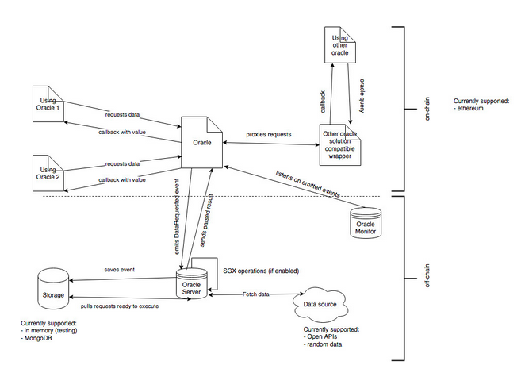

1. [Technical Oversight Committee](index.html)
2. [Technical Oversight Committee Home](Technical-Oversight-Committee-Home_21430274.html)
3. [Archived](Archived_21447696.html)
4. [Project Proposals](Project-Proposals_21430788.html)
5. [2019 Finished Proposals](2019-Finished-Proposals_21447897.html)

# Technical Oversight Committee : Gardener

Created by Ekin Tuna, last modified by Nathan George on Aug 22, 2019

# HIP Identifier

Hyperledger Gardener

# Sponsor(s)

Sylwia Rogowicz 

[sylwia.rogowicz@espeo.eu](mailto:sylwia.rogowicz@espeo.eu)

Krzysztof Wedrowicz

[krzysztof.wedrowicz@espeo.eu](mailto:krzysztof.wedrowicz@espeo.eu)

Krzysztof Spisak-Spisacki 

[krzysztof.spisak.spisacki@espeo.eu](mailto:krzysztof.spisak.spisacki@espeo.eu)

Ekin Tuna 

[ekin.tuna@espeo.eu](mailto:ekin.tuna@espeo.eu)

# Introduction

Gardener is a modular and secure oracle node implementation for transferring external data into a blockchain. It allows for the integration of multiple data sources and security features from which an oracle node can be containerized. Gardener provides the libraries and integrations for the data sources, security features and integration to Hyperledger Fabric.

# Context

The initial contributions to Gardener have been made by Espeo Software (espeo.eu). It is licenced under the open source MIT license and the source code can be found at [https://github.com/EspeoBlockchain](https://github.com/EspeoBlockchain). 

# Motivation

Originally Gardener was realized through practical development challenges. At Espeo we developed multiple blockchain solutions that required data derived from an external source. All the oracles available were closed source at some portion of the software, and none of them were free to use. This is why we decided to offer a free and open oracle for every developer in the blockchain space.

Gardener is a free to use, fully open source oracle node implementation. It is important to have a modular solution that can be deployed easily and integrated to any blockchain. This will ease the development work and allow for a secure way for accessing off chain data. This is why we have developed the tools, modules and documentation for Gardener.

# Status

The development work of Gardener is actively ongoing and undertaken by Espeo Software. So far the public API access, IntelSGX based random data (sgx\_read\_rand function) and oracle monitoring tool are already developed. The ongoing work tasks include:

- Hyperledger Fabric integration
- IntelSGX remote attestation
- Proven off chain computation

Our code is available at [https://github.com/EspeoBlockchain](https://github.com/EspeoBlockchain). 

# Solution

Oracle architecture diagram:

# 

Gardener project consist of 2 main components and 1 support utility. The first main component is a set of smart contracts (or chaincodes) with the main one called Oracle and others, which act as helpers. All requests go through the Oracle contract, which knows how to handle each of them. The responsibilities of the Oracle contract are request validation. This means checking that the entity performing the request is valid and that the parameters of the request are correct. It also issues events about new requests and proxies the requested data back to the correct address. Contracts using the oracle have to be either extending Gardener using the Oracle contract or at minimum following its interface. 

Gardener offers also wrappers for other oracle solutions like OraclizeIT to allow users to easily migrate from SaaS solutions to Gardener without changing implementation. Wrappers are translators between the backward compatible interface of another oracle into the interface of Gardener oracle  (currently only OraclizeIT is supported, but others can be added easily on demand).

The second main component of Gardener project is the Gardener Server. It is the off chain entity that fetches and passes the information that was requested by the Oracle contract. It was designed using a hexagonal architecture approach. This means that in its core it keeps business logic of its behavior and all the technical implementations are external. Because of this new integrations can be added very easily by just writing the technical integration. This means that integration of, for example, a new blockchain, storage or data source is easy and does not require modifications to the main flow of the application. 

The main flow of the server application looks as follows: the server listens for new blocks in a given blockchain. If new blocks appear they are checked for events related to oracle requests. If there are any, the events are saved into storage (all requests are saved regardless if they are delayed or not). We use the system scheduler Cron for checking the saved events for delayed requests. Cron periodically asks storage for requests, which are ready to execute. The requests which are ready are parsed from the stored string request. After parsing the request the requested data is fetched and the received response is filtered using one of commonly known filtering patterns. Currently we support JSONPath and XPath supported for filtering. Finally, the filtered data is then pushed to the blockchain as a new transaction.

The third component, the helper for the main components, is Gardener Monitor. It helps to look at incoming requests and outgoing responses. It connects directly to Oracle contract and monitors state changes in it. It is designed to help during development as a GUI interface and in the future we plan that it would also allow to check proofs or executed processing.

Currently the only supported blockchain is Ethereum. However, Gardener team is on their way to introduce a Hyperledger Fabric integration. Thanks to the architecture design described above that integration should not be much time-consuming. We are currently working on writing the complementary chain codes which have the same responsibilities as smart contracts written for Ethereum. By doing so we will add a Hyperledger Fabric integration into the Gardener Server. Some Proof of Concept work was already done and now the result of it is waiting to be incorporated into more production-ready software.

# Efforts and Resources

Currently there are four core people working on Gardener, outlined at the Sponsor(s) section. All are working part-time. 

Two main backend developers involved are Krzysztof Wedrowicz and Krzysztof Spisak-Spisacki. In addition we have multiple other developers working on various components  We hope to have larger Hyperledger community support in the future as we further our development. 

# Road map

October 2019

- Hyperledger Fabric integration
- IntelSGX remote attestation
- Update, refactor and polish the Monitor

After October 2019

- Off Chain computation with and without proofs
- Work on other Hyperledger greenhouse projects
- Decentralized consensus based on ring signatures
- SWIFT / payment integrations

# Reviewed By

- Arnaud Le Hors
- Baohua Yang
- Binh Nguyen
- Christopher Ferris
- Dan Middleton
- Hart Montgomery
- Kelly Olson
- Mark Wagner
- Mic Bowman
- Nathan George
- Silas Davis

## Attachments:

 [Screen Shot 2019-07-17 at 10.18.11.png](attachments/21431378/21448135.png) (image/png)

Document generated by Confluence on Nov 26, 2024 11:24

[Atlassian](http://www.atlassian.com/)
