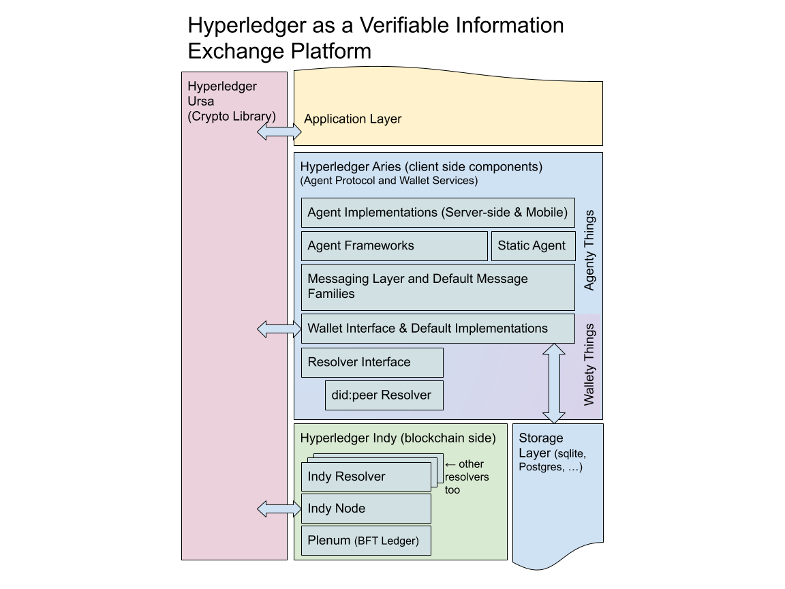

1. [Technical Oversight Committee](index.html)
2. [Technical Oversight Committee Home](Technical-Oversight-Committee-Home_21430274.html)
3. [Archived](Archived_21447696.html)
4. [Project Proposals](Project-Proposals_21430788.html)
5. [2019 Finished Proposals](2019-Finished-Proposals_21447897.html)

# Technical Oversight Committee : Hyperledger Aries Proposal

Created by Nathan George, last modified by Arisht Jain on Dec 17, 2019

# Project Identifier

HIP Identifier: Hyperledger Aries

(Introduced to some as a “Hyperledger shared wallet project,” but that moniker is an incomplete description, read on to find out more.)

Accepted and now tracking setup at [Aries New Project Checklist](https://lf-hyperledger.atlassian.net/wiki/spaces/CA/pages/20548561/Aries+New+Project+Checklist)

# Sponsor(s)

Nathan George, Sovrin Foundation, [nathan@sovrin.org](mailto:nathan@sovrin.org)

Stephen Curran, [cloudcompass.ca](http://cloudcompass.ca), [swcurran@cloudcompass.ca](mailto:swcurran@cloudcompass.ca)

Daniel Hardman, Evernym, [daniel.hardman@evernym.com](mailto:daniel.hardman@evernym.com)

Vipin Bharathan, dlt.nyc, [vip@dlt.nyc](mailto:vip@dlt.nyc)

Jegan Selvaraj, [sj@troondx.com](mailto:sj@troondx.com), [adi@troondx.com](mailto:adi@troondx.com)

John Jordan, Province of BC, [john.jordan@gov.bc.ca](mailto:john.jordan@gov.bc.ca)

Tobias Looker, Mattr, [tobias.looker@m](mailto:tobias.looker@spark.co.nz)attr.global

Robert Mitwicki, Lab10 Collective, [robert.mitwicki@lab10.coop](mailto:robert.mitwicki@lab10.coop)

Steve McCown, Anonyome Labs, [smccown@anonyome.com](mailto:smccown@anonyome.com)

Troy Ronda, SecureKey Technologies, [troy.ronda@securekey.com](mailto:troy.ronda@securekey.com)

Markus Sabadello, Danube Tech, [markus@danubetech.com](mailto:markus@danubetech.com)

&lt;Please contact @nage on [https://chat.hyperledger.org](https://chat.hyperledger.org) to be added as a sponsor&gt;

# Abstract

Hyperledger Aries is infrastructure for blockchain-rooted, peer-to-peer interactions. It includes a shared cryptographic wallet (the secure storage tech, not a UI) for blockchain clients as well as a communications protocol for allowing off-ledger interaction between those clients.  This project consumes the cryptographic support provided by Hyperledger Ursa, to provide secure secret management and decentralized key management functionality.

# TL;DR

Hyperledger Aries is infrastructure for blockchain-rooted, peer-to-peer interactions. It includes:

- A blockchain interface layer (known as a resolver) for creating and signing blockchain transactions
- A cryptographic wallet that can be used for secure storage of cryptographic secrets and other information (the secure storage tech, not a UI) used to build blockchain clients
- An encrypted messaging system for allowing off-ledger interaction between those clients using multiple transport protocols.
- An implementation of ZKP-capable W3C verifiable credentials using the ZKP primitives found in Ursa.
- An implementation of the Decentralized Key Management System (DKMS) specification currently being incubated in Hyperledger Indy.
- A mechanism to build higher-level protocols and API-like use cases based on the secure messaging functionality described earlier.

Hyperledger Aries consumes the cryptographic support provided by Hyperledger Ursa to provide both secure secret management and hardware security modules support.

# Context

Hyperledger Aries is a client tool suite and framework code for trusted peer interactions and information exchange, as such it is an excellent toolkit for secrets management and can serve as a blockchain client for many systems.  It is related to Hyperledger Indy, which provides a resolver implementation, and Hyperledger Ursa, which it uses for cryptographic functionality.

The project also makes extensive use of the Verifiable Credentials and Decentralized Identifier standards being incubated at the W3C.

# Dependent Projects

The project has grown out of the Indy community, but after the technology from Indy has migrated will **not** be dependent upon Indy.

# Motivation

Indy has been incubating protocol work for peer interactions between identity owners for some time.  As this development community has grown it has become clear that the scope of that work extends beyond the functionality provided by Indy.  Aries aims to make the peer interaction code needed for secrets management, verifiable information exchange, and secure messaging accessible across different decentralized systems.  This will allow us to foster practical interoperability in support of ongoing standards work and extend the applicability of technologies developed within Indy beyond its current community.

# Status

This project will start in incubation. 

The Indy community is eager for initial approval to help build support for the project outside of the traditional Hyperledger community.  It is expected that the initial code migration may take some time to avoid any disruption to Indy release schedules and active adoption of the protocol being specified.

# Scope

The following is a list of functionality expected to be in scope.  Items in normal text are currently being built/incubated within Indy, items in *italic* text have been considered as part of the architecture, but are not required until a maintainer commits to build and maintain the functionality.

- - Feature list (see the thing that is in the abstract now and talk about it more like requirements)
    
    - TXN resolver
    - Verifiable Data Registry Resolver
    - Value Transfer Resolver
    
    <!--THE END-->
  - - Resolver Layer

<!--THE END-->

- - - *Smart Contract-like resolving (we see this as group issuance to a shared context?)*
    - Wallet Layer
      
      - Encryption
      - Signing
      - Attestation
      
      <!--THE END-->
    - - Secrets management with Ursa

<!--THE END-->

- - - - *Advanced–Crypto compute in TEE*
      - Key Storage
      - Backup/Restore
      - Credential Data storage
      - Searchable Storage Interface
        
        - sqlite backend
        - postgresql backend
        - Others as contributed:
        - - Kademlia backend
        - *Decentralized Storage (like IPFS, Swarm, etc.)*
        
        <!--THE END-->
      - - Storage backend implementations

<!--THE END-->

- - - Messaging Layer
    - - Anoncrypt, Authcrypt and routing needed for supporting multiple transport layers.
      - Introduction protocol (To accomplish key exchange for bootstrap message encryption)
    - Message Families
    - - Enumeration of capabilities
      - Collections of messages that create protocols or a common set of functionality
    - Message Families included in the core
      
      - Issuer, Verifier, Holder
      
      <!--THE END-->
    - - Anoncreds (ZKP protocol for W3C Verifiable Credentials)
      - *JWT Verifiable Credentials*

<!--THE END-->

- - - - DKMS
      - - Introduction protocol
        - Key recovery
        - Social recovery
        - Wallet backup and restore
      - *Web Authentication compatibility (proxy credentials into legacy protocols)*
        
        - WebAuthN
        - OIDC
        - OAuth

<!--THE END-->

- - - Language Idiomatic Library wrappers
      
      - Additional platform-specific functionality
      - Prototypes of functionality prior to agreeent on inclusion in the core
      - Languages Supported
        
        - Python
        - Rust
        - Java
        - Go
        - Ruby
        - PHP
        - Objective C
        - *Others Welcome*

<!--THE END-->

- - - Agent Frameworks
    - - Python reference framework - simple to understand as an example for other frameworks
      - *High performance Rust framework*
      - *Others welcome*

<!--THE END-->

- - - Reference Agents
    - - Indy Catalyst Agent (Python)
      - Python Reference Framework - simple to understand as an example to other agents
      - Python Test Suite - implementation of an agent used for proving wire-level protocol interoperability between other implementations

The initial scope of this project sets out to develop software that enables the facilitation of peer to peer messaging, controlled exchange of data, and the support of interaction with different blockchains and other DLTs.

To enable peer to peer messaging system we will rely on the ongoing work in the Indy HIPE repository to support a transport agnostic messaging layer designed to send messages using end-to-end encryption. The E2E encryption will support the capabilities of both an anonymous messaging system, authenticated messaging system, as well as routing functionality to aid in the exchange of these messages using a methodology that allows metadata correlation to be controlled.

This messaging layer will require a secure storage solution to perform key management as well. We consider it in scope that this project supports the management of keys through the secure wallet which is intended to store keys, credentials, and other secure data. With this comes a standard storage interface, that allows for pluggable backend support. For additional data, we’ll also enable the storage of data.

Additionally, it is the intent of this project to provide a dynamic set of capabilities to store the data that is exchanged. These capabilities will range from the secured, secret storage of data such as private keys, up to the capability of globally accessible data that can be viewed and accessed by anyone. As an example, we’d like for a secure storage solution similar to the wallet available in Hyperledger Indy today that would be capable of storing, verifiable credential data, private keys, relationship state data, and functionality that can perform operations with this data without having to extract this data. For example, encrypting a message should be possible using an authenticated encryption format, which uses a symmetric key generated with an DHKE using a private key stored in the secure wallet and a public key of the recipient which is provided through the API call. There will also a be scalable, searchable storage layer which will be capable of storing other associated data necessary for the maintenance of an identity. Examples of data which may be stored in this layer would be pictures, health records, or other personal data.

Other functionality that would be in scope for a 1.0 project release would be a Decentralized Key Management Solution (DKMS) which would add key recovery, social recovery, and wallet backup and restore functionality. Much of this work would be based on the DKMS documents outlined in the [Indy-HIPE dkms design folder.](https://github.com/hyperledger/indy-hipe/blob/49fcd78883d38babe9c95a4e1d150969797cffa2/design/dkms/README.md)

We also intend for project Aries to support multiple DID methods through a generic resolver interface. This generic interface will initially support the Hyperledger Indy resolver but will be extensible so that if someone wanted to build a pluggable Hyperledger Fabric DID method resolver, Ethereum DID method resolver, or another DID method resolver in they could. These resolvers would support the retrieval of transactions and other immutable data that has a shared state on a ledger. One of the other pieces that will come built into this project will be support for a peer DID method resolver which will rely upon the wallet and p2p messaging protocol to maintain the state of a peer-to-peer relationship. Another interaction that the resolver interface will support is the ability to read data that exists in a verifiable data registry. An example of a VDR is the Indy Catalyst project.

With all of these capabilities, we’ll now be able to build core message families that are necessary to facilitate interactions of an identity. Examples of these core message families would be a verifiable credentials protocol with and without ZKPs, introduction protocol, challenge-response protocol, and others that are deemed necessary by the maintainers of this project over time. An example of another component we would like to see, but do not currently have maintainer support (and therefore consider out of scope for a 1.0 release) for the integration of WebAuthN, OpenID connect, and OAuth 2.0 standards which would allow a developer to integrate verifiable credentials with current standards.

It is also within the scope of this project is the ability to extend the capabilities of the system easily where a business or developer is only required to understand the nature of the interaction which is referred to as “developing an extensible protocol”. This would allow for a developer to extend the use of the core components of Aries, to build higher level abstraction layers on top to facilitate new capabilities. For example, it is within reason for a developer to use the Aries project as a springboard to building a peer to peer ride-sharing protocol.

# Solution

The above diagram represents the current picture that exists once code and build processes transition out of Indy and into Aries.  After this happens, three phases of updates the Indy project are anticipated. In phase one Indy can become the home to additional blockchain resolvers beyond Plenum, provided those chains parallel the extended verifiable credentials data model used for the W3C Verifiable Credentials specification in conjunction with additional elements for cryptographic protocol support.  Resolvers that are specialized for other cases are welcome as use cases for the resolver interface in Aries, but are likely better housed inside their respective projects. Phase Two includes the “Indy Ledger Next” initiative, which is an upgrade of their ledger protocol, this means that in the short term Indy may share a BFT ledger component with another project or that Plenum may undergo a significant renovation for a “2.0” release--this phase should not be ignored, as it is important to on-boarding new maintainers and building a common knowledge base for phase three.  The third phase can only happen after Aries has achieved 1.0-level stability. Once we have stable extensible message families, it makes sense to add basic consensus framework support to the system (possibly including shared components like Hyperledger Transact) to allow wallet synchronization and decentralized data processing for agents. We anticipate that this tool-kit will be reusable towards constructing BFT ledgers, and can serve as a basis of a new Indy ledger component that builds on top of Aries, instead of Aries depending on Indy.

# Efforts and Resources

We propose the creation of the following repositories on GitHub to manage Hyperledger Aries:

- [https://github.com/hyperledger/aries](https://github.com/hyperledger/aries) (migrate some, but not all code from indy-SDK, remaining indy-SDK would become the indy-resolver loaded by an Aries agent)
- [https://github.com/hyperledger/aries-rfcs](https://github.com/hyperledger/aries-rfcs) (migrate related indy-hipe docs).
- [https://github.com/hyperledger/aries-agent](https://github.com/hyperledger/aries-agent) (migrate from indy-agent)

As part of this move, we are planning on using git-filter to update history to better account for the DCO process adopted after the Indy project’s inception.

It is important to note that the proposed Hyperledger Aries community has already built a significant contributor base and holds active conversations and regular calls.  The indy-agent project space in Jira, and the #indy-agent channel can be rebranded to aries-agent. The new project will require a mailing list and general #aries channel.

# FAQ

1. Cross-platform integration:  One of the main purposes of this project is to change the Hyperledger Indy’s client layers to be less Indy-specific and support more accessible to permissioned blockchain platforms and support other interested decentralized identity projects.  It is expected that the Aries project will support the did:peer method out of the box and Indy will provide did:indy and did:sov support. Support for further DID methods (for Fabric, Iroha, Sawtooth, and other platforms) will depend on interest from those frameworks but should be straight forward, based on the open-standards approach of the current design.  We are very interested in sponsors, resolver maintainers or learning of any integration interest from other projects.
2. Why not just do this in Indy?:  It is very important to help pull together efforts across Hyperledger projects, DIF, W3C standards efforts and elsewhere to make agent interactions interoperable across the self-sovereign identity community.  These agents are as valuable as they are compatible and building tools that have clear protocol-level interoperability increases their usefulness, security, and applicability to trusted information sharing across industries and the traditional boundaries that currently exist.
3. Why include the Agent stuff, why not just a wallet? We expect this code base will fully support the Decentralized Key Management Standards (DKMS) that are being worked on by the Sovrin Community.  To fully support DKMS clients need a way to interact with one another peer to peer, which is being worked on in the indy-SDK and indy-agent layers.  With the main wallet and cryptographic code moving to its own project, it makes sense to move the pieces necessary to support that process with them in order to support a standards-driven approach and avoid cross dependencies between Indy and Aries.
4. How does this relate to other initiatives? One of the main goals of splitting Agent communication efforts out of Indy into its own project is to allow a features and functionality outside of the scope of the Indy ledger to planned and fully supported.  As such, we have reached out to other groups, including Ethereum-based decentralized identity efforts and others participating at the W3C to contribute to this code base. Hyperledger has proven to be a collaborative and open environment for growing the community and has helped us attract a variety of contributors.

<!--THE END-->

- Decentralized Identity Foundation - the Decentralized Identity Foundation currently hosts collaboration on what is called a “storage and compute working group” that has a lot in common with Hyperledger Aries, we invite all participants there to collaborate with the project and explore further integration with work at DIF
- W3C Credentials CG - Hyperledger Aries is an implementation effort focused on working out a shared implementation for Decentralized Identifier clients, verifiable  credentials and general key management issues. It is not a standards organization, and the intent is to leverage the Apache 2.0 license and DCO compliance of the system to incubate protocol implementation that can inform and accelerate standards efforts at the W3C, OASIS and elsewhere.

As part of efforts to facilitate more open collaboration other communities have invited us to host the Aries project elsewhere.  It is the Indy maintainers opinion that continuing the momentum Indy enjoys at Hyperledger makes for an excellent platform for launching the project, and if further collaboration opportunities emerge, we will explore co-branding developer calls as working groups with the other organizations.

Why Aries? The Indy community  and the identity working group went through multiple rounds of polls to find a name that seemed memorable, didn’t have obvious name confusion issues and wasn’t disliked in a particular way by those who would serve as maintainers.  Consensus was we wanted a short name that fit alongside Indy and Ursa (two components that leveraged extensively in Indy). Aries was the top vote getter in this process. Aries is a constellation in the zodiac, usually represented by a ram.  Agent software is about being able to assert yourself as an independent actor and climb to previously inaccessible places in the digital world. The name should be considered provisional pending approval by the marketing committee.

# Closure

The project success can be measured by ability to use the agent protocol to communicate with code bases.  If support of verifiable credentials, DIDs, or other peer to peer communications provided by this code base doesn't materialize outside of Indy it may be appropriate to fold this project back into Hyperledger Indy.

# Reviewed By

- Arnaud Le Hors
- Baohua Yang
- Binh Nguyen
- Christopher Ferris
- Dan Middleton
- Hart Montgomery
- Kelly Olson
- Mark Wagner
- Mic Bowman
- Nathan George
- Silas Davis

## Attachments:

 [Hyperledger Aries Proposal(1).png](attachments/21430282/21447916.png) (image/png)

Document generated by Confluence on Nov 26, 2024 11:24

[Atlassian](http://www.atlassian.com/)
