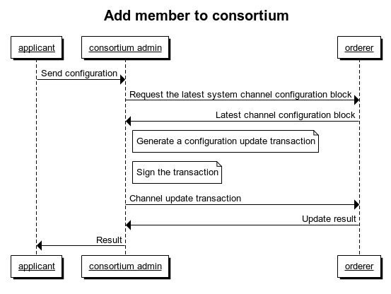
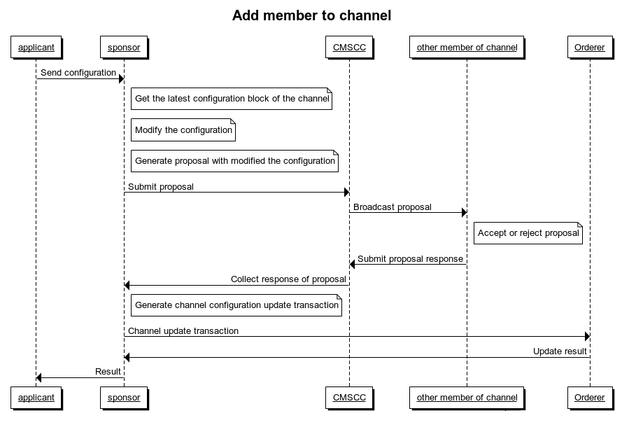

1. [Technical Oversight Committee](index.html)
2. [Technical Oversight Committee Home](Technical-Oversight-Committee-Home_21430274.html)
3. [Archived](Archived_21447696.html)
4. [Project Proposals](Project-Proposals_21430788.html)
5. [2019 Finished Proposals](2019-Finished-Proposals_21447897.html)

# Technical Oversight Committee : Hyperledger Justitia Proposal

Created by RuiLiu, last modified by Kelly Olson on Aug 14, 2019

# Status: Proposal moved to Fabric community per comments below.

# Project Identifier

Hyperledger Justitia helps users create and maintain consortiums on fabric. HIP 0.1

# Sponsor(s)

SHIJINSHI Credit Information Service Company, [business@shijinshi.cn](mailto:business@shijinshi.cn)

&lt;If you want to join as a sponsor, please feel free and contact the project maintenance staff by email. [liurui@shijinshi.cn](mailto:liurui@shijinshi.cn) &gt;

# Abstract

Justitia helps consortium members generate and maintain all of their certificates, easily deploy and maintain their own nodes. On the other hand, it helps users manage the configuration of consortium and channels, including configurations such as members and policies.

# Motivation

Initially, we envisioned creating a large chain of alliances in which all participants were equal. Each of them maintains their own nodes and certificates on the network. Some or all of the members of the alliance can conduct independent business cooperation in different channels by the fabric multi-channel feature. However, in the actual operation, we found that the process of deploying the fabric node in the way of running the script is complicated and error-prone, and the whole alliance is difficult to expand and maintain. Therefore, we urgently need a tool to help us manage the identity, nodes, channels, and consortium members on the fabric.

Justitia was developed to help customers more easily deploy fabric nodes so that customers can more easily join our business. Justitia not only helps affiliate members manage all of their identity data in the federation, but also helps users deploy fabric nodes, dynamically create and manage channels, and members of federation.

When the entire project is nearing completion, we consider contributing it to the community to help more users with the same needs. In the process of preparing for the contribution, we saw a similar project Cello in the community. After an in-depth understanding and comparison, it was found that Cello and Justitia have very different ways of deploying fabric network nodes. Cello can easily deploy a fabric network, but Cello is not good enough for certificate management and node deployment, and it cannot manage consortium members and channel members. We believe that Justitia can just make up for the lack of cello in some scenarios, which further strengthens our determination to open source this project. Of course, in the subsequent versions we will also learn the excellent design of Cello as much as possible.

# Status

This project will start in incubation.

The basic functions of the project have been implemented, but some of the functions are not perfect and need to be optimized, we will improve these parts in the future.

# Solution

This project uses Fabric ca manage and maintain organizational identity information, and maintains and monitors Fabric nodes by using docker's http PAI, and maintain data on the fabric network through fabric-sdk-java. The structural design of the project is divided into four parts, as shown in the following picture. The DB/File is used to store identity data including certificates and private keys. Service defines some business modules that are provided to the Scheduler call. The Scheduler performs identity verification and defines a series of REST interfaces; the WEB provides data display and service calls through the REST interface provided by the Scheduler.

1. Dao serverProvide data storage and read interface, you can customize to use different databases according to your needs, MYSQL is used by default.
2. Fabric serverThe fabric-sdk-java is packaged to provide some simple service interfaces.
3. Chaincode serverProvides chain management capabilities such as installation, instantiation, and upgrade with the Fabric SDK. Chain code installation supports uploading local source files and getting codes from the code repository.
4. Node serverBy calling Docker's Rest API to create and manage node containers, users can dynamically adjust the number of nodes as needed. When deploying a node, the system provides a default configuration for the node, and the user can also override the configuration according to the actual situation. The system monitors the status information of the node. When the status of the node is abnormal, the system notifies the administrator to handle the situation through email or SMS.
5. Identity serverThe maintenance of identity information is done by means of fabric ca, including registration, renewal and revocation of certificates. In the database, we store the certificate and private key so that when the user needs to deploy a new node or use a new client user, the service can provide all the required certificates and private keys. When the certificate needs to invalidate the original certificate due to the leakage of the private key, etc., the system can help the user revoke the relevant certificate and update the CRL to the channel configuration.
6. Channel server
   
   Channel services manage a member of consortium or channel by submitting channel configurations.
   
   The consortium administrator who holds the private key of the administrator of the orderer can manage members of consortium by modifing the configuration of the system channel. The applicant generates configuration data including the identification information of the organization by the system, and then sends it as an application material to the consortium administrator through other forms such as mail.
   
   If the administrator agrees to join the consortium (the corresponding approval mechanism has specific business decisions), he will obtain the latest system channel configuration block from the orderer node and add the configuration information submitted by the applicant to the consortium to generate a configuration update transaction. After that, the applicant has the same rights as other members as members of the consortium, and can also create channels. For deleting a consortium member, remove the configuration of the corresponding member from the consortium configuration with the same operation.
   
   
   
   The management of channel members and channel configurations is similar to that of managing consortium. It is implemented by the administrator user of the channel member initiating a transaction that modifies the channel configuration. However, unlike modifying the system channel, the administrator who wants to modify the channel configuration in the default policy requires more than half of the organizations in the channel to endorse the modification proposal. Of course, this policy is modifiable. On the other hand, the process of endorsing by the organization administrator user cannot be done on the chain. It is too complicated to introduce a centralized service to help complete the signature process. In order to solve this problem in the chain, we added a system chain code CMSCC (channel manager system chain code) to the implementation of this signature process. The process of joining a member as shown in the figure below is similar to the process of joining a consortium. The applicant sends an application for joining to the sponsor (any member of the channel), and the sponsor obtains the latest configuration block generation channel update transaction of the channel. This transaction is broadcast to other members of the channel by means of the CMSCC, and other members may choose to accept or reject the application. Until the number of accepted members meets the channel policy, the sponsor sends the signature result and the update transaction to the Orderer node to update the channel configuration. The applicant then has the same authority as the channel members as other members. For deleting a channel member, remove the configuration of the corresponding member from the channel configuration with the same operation.
   
   

# Efforts and Resources

We have now hosted the original version of the code to github ([https://github.com/shijinshi/justitia](https://github.com/shijinshi/justitia)). Although it uses Chinese in many places now, and the documentation is not perfect. But we will refactor the next perfect version as soon as possible based on the design mentioned in this article. In addition, we hope to be able to transfer the code to github's hyperledger user in the next version so that more people can see the project. It is worth noting that for this project we have set up a dedicated team to manage and maintain until the end of the entire project incubation. Of course, we also welcome other developers to join us and make it better.

# How To

This project is a front-end separation project implemented by Spring boot + React. Users can choose to deploy by compiling source codes or running docker images. After the deployment is complete, it can be accessed through a browser. On the first visit, we provide a boot process to help the user initialize the system configuration.

# Closure

The success of the project can be checked to see if they are complete and stable by verifying the functionality of the Solution section. In addition, as follow-up versions follow up, we may also add new features to Justitia.

# Reviewed By

- Arnaud Le Hors
- Baohua Yang
- Binh Nguyen
- Christopher Ferris
- Dan Middleton
- Hart Montgomery
- Kelly Olson
- Mark Wagner
- Mic Bowman
- Nathan George
- Silas Davis

## Attachments:

 [Add member to consortium.png](attachments/21431331/21448100.png) (image/png)  
 [Add member to channel.png](attachments/21431331/21448101.png) (image/png)  
 [架构.png](attachments/21431331/21448099.png) (image/png)

Document generated by Confluence on Nov 26, 2024 11:24

[Atlassian](http://www.atlassian.com/)
