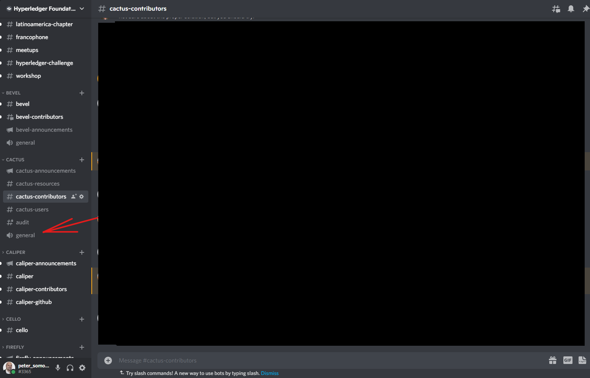

1. [Hyperledger Cacti](index.html)
2. [Hyperledger Cacti Home](Hyperledger-Cacti-Home_20414469.html)

# Hyperledger Cacti : Daily Pair Programming Calls

Created by Peter Somogyvari, last modified on Feb 08, 2024

**How to Join**

1. Join the Hyperledger Foundation Discord Server: [https://discord.gg/invite/hyperledger](https://discord.gg/invite/hyperledger) (10 AM Pacific Time)
2. Locate the channel category called **Cacti**
3. Within that category, locate the voice channel called **general** as seen on the screenshot below.
4. If your microphone doesn't work or for whatever reason you cannot do a voice call, just post your question on the chat instead and make sure to tag the group called **@Cacti Maintainer** in your message so that the maintainers (who are most likely to know the answer to your question) get a notification about the message!
5. 
   
   

## Attachments:

 [Screenshot 2022-06-09 172639.png](attachments/20415460/20415461.png) (image/png)

Document generated by Confluence on Nov 26, 2024 12:37

[Atlassian](http://www.atlassian.com/)
